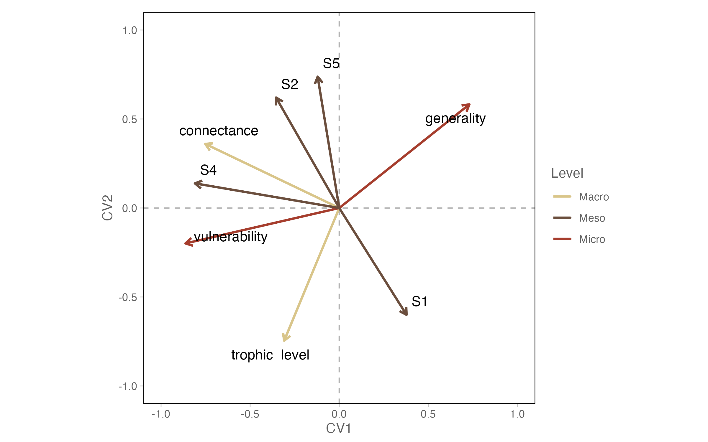
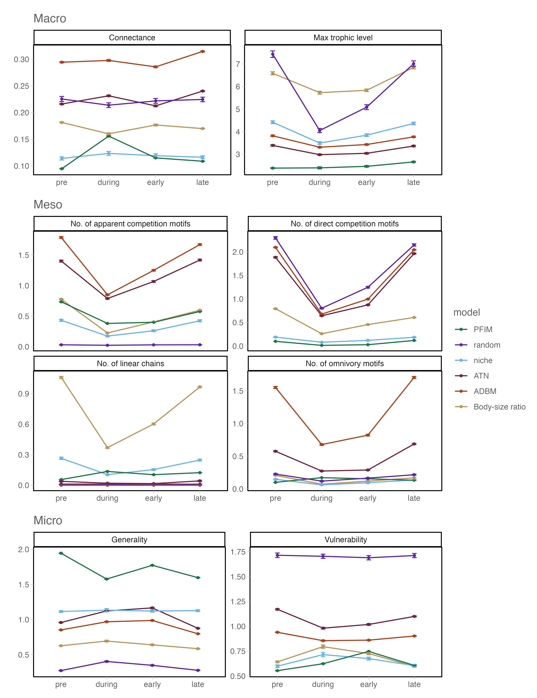
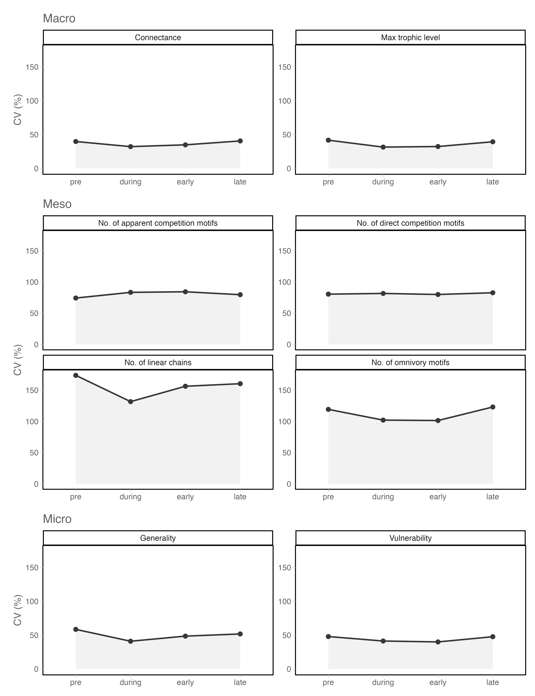
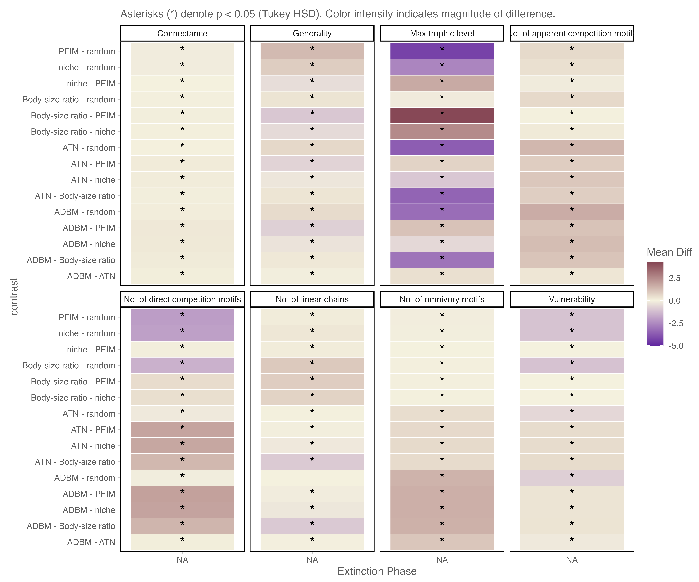

# Additional Results and Analyses

## Effects of Network Reconstruction on Food-Web Structure

### Table S1. Descriptive statistics (mean ± standard deviation) of network metrics by model

```{r}
library(knitr)
library(tidyverse)

readr::read_csv("tables/Table_S1_descriptive_stats.csv") %>%
kable()

```

### Table S2. Canonical discriminant analysis

```{r}

readr::read_csv("tables/canonical_loadings.csv") %>%
kable()

```

### Figure S1. Canonical Loadings

Canonical loadings for the first two canonical variates (CV1, CV2) from the canonical discriminant analysis of network metrics. Arrows indicate the contribution of each metric to the multivariate separation among reconstruction models. Colours denote the scale of each metric: Macro (light brown), Meso (brown), Micro (sienna). Metric labels are shown for the most influential variables.



### PERMANOVA Variance Partitioning

To quantify the relative contributions of reconstruction framework and temporal turnover to variation in inferred network structure, we conducted permutational multivariate analysis of variance (PERMANOVA). Euclidean distance matrices were calculated from standardised (z-transformed) network metrics. Reconstruction framework ('model') and extinction phase ('time') were analysed separately to estimate their total contributions to variance, and in combination to assess interaction effects. Significance was assessed using 999 permutations.

#### Robustness of model effects after temporal centering

To determine whether the dominance of reconstruction framework reflected absolute structural shifts among extinction phases, we repeated the analysis after centering network metrics within each time bin. This procedure removes mean temporal differences while preserving within-phase structural variation. Even after temporal centering, reconstruction framework explained 84.8% of multivariate variance (R² = 0.848, p < 0.001), exceeding the variance explained in the uncentered analysis. Thus, the strong influence of model identity is not attributable to temporal mean differences, but reflects intrinsic structural divergence among reconstruction frameworks.

## Statistical Drivers of Network Variation

### Statistical Robustness and Assumptions

Factorial ANOVA assumptions were validated via residual analysis. Despite significant heteroscedasticity (Levene’s test, p<0.001), the perfectly balanced design (n = 100 per cell) and large sample size (N = 2400) ensure the robustness of the F-test. Visual inspection of Q-Q plots and Residuals-vs-Fitted plots confirmed that the distributions were sufficiently symmetric for parametric analysis.

### Figure S2. Temporal Trajectories of Network Structure by Model

Detailed shifts in network properties across the four extinction phases, categorised by organisational scale (Macro, Meso, Micro). Each line represents the mean value for a specific reconstruction framework, with error bars denoting standard error. This figure illustrates the "baseline" differences between models—such as the Niche model's tendency to over-estimate motif counts—and their divergent responses to species loss.



### Table S3. Variance Partitioning of Framework, Time, and Interaction Effects.

Summary of the two-way factorial ANOVA results for all eight metrics. Values represent partial eta-squared ($\eta^{2}_{p}$), which quantifies the proportion of variance explained by each factor. The dominance of the 'Model' term across all scales confirms that framework choice is the primary determinant of network topology.

```{r}

readr::read_csv("../tables/ANOVA_Results.csv") %>%
kable()

```

### Figure S3. Model Disagreement (CV%) Across Extinction Phases

Trends in inter-model disagreement, quantified as the Coefficient of Variation (CV%) between framework means. The Y-axis is standardised across panels to facilitate comparison between organisational scales. A characteristic "dip" at the 'during' phase in several meso-scale metrics illustrates the structural canalisation effect, where severe species loss forces a temporary convergence in model predictions.



### Table S4. Percentage Disagreement Between Frameworks Across Extinction Phases.

Calculated inter-model CV% for each metric at each time step. These data points underpin the bubble sizes in Figure 2 and the trajectories in Figure S3. Note the reduction in CV% for linear chains and omnivory motifs during the peak extinction phase (During).

```{r}

readr::read_csv("../tables/Model_Agreement_CV.csv") %>%
kable()

```

### Figure S4. Pairwise Framework Comparisons (Tukey HSD)

Heatmap showing significant differences between specific pairs of reconstruction frameworks across each extinction phase. Colours represent the magnitude and direction of the difference (estimate); asterisks ($*$) indicate statistical significance (p<0.05). This identifies which specific models drive the high CV values seen in Figure 2.



# References {.unnumbered}

::: {#refs}
:::